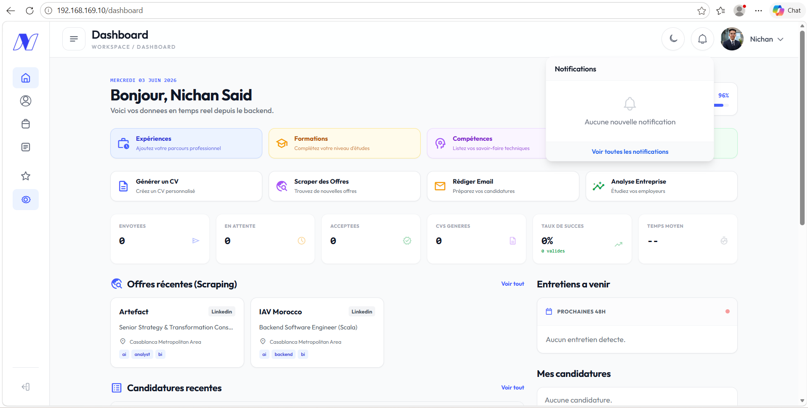
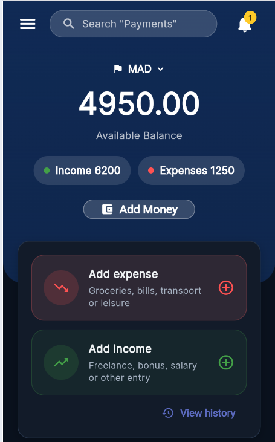
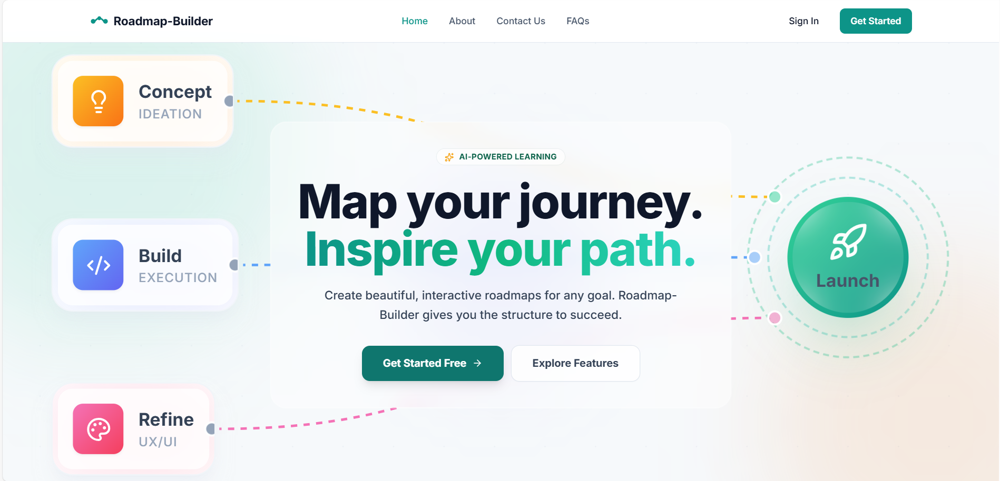
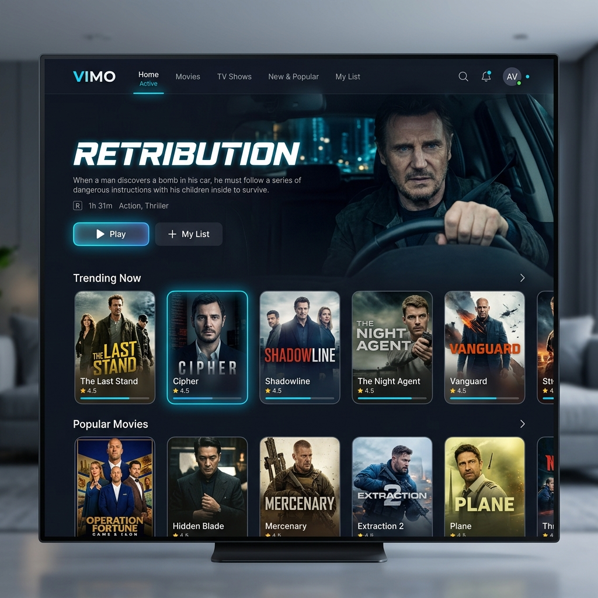
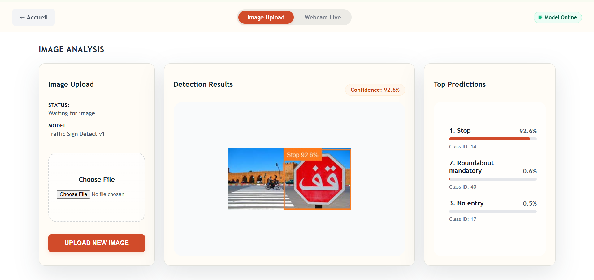
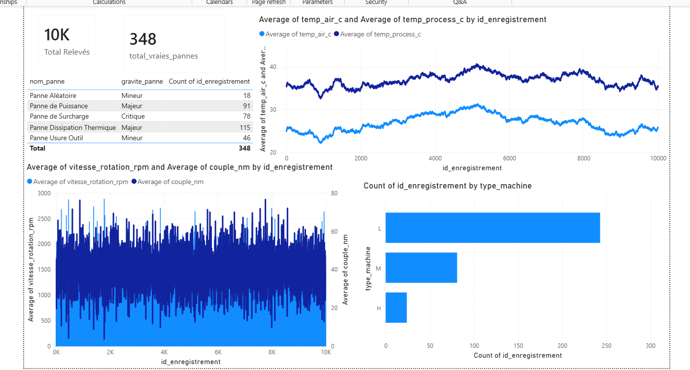
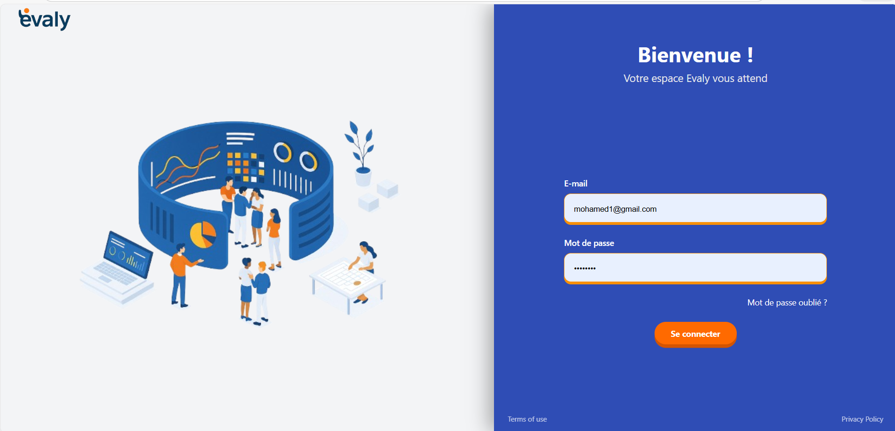
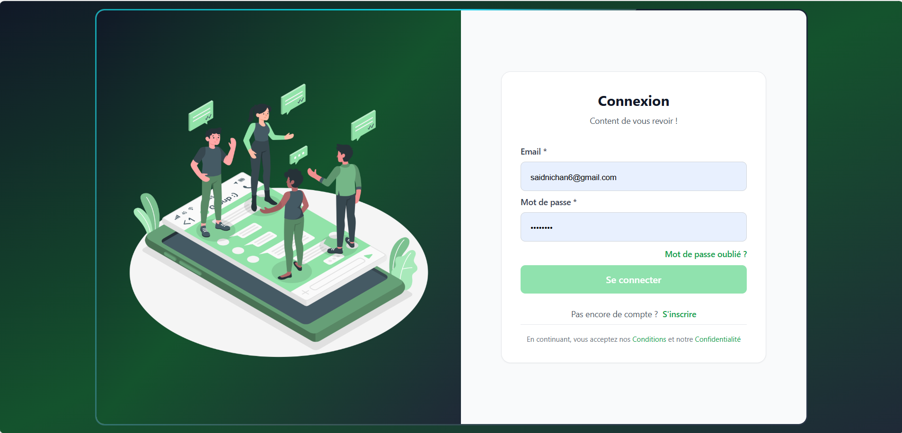
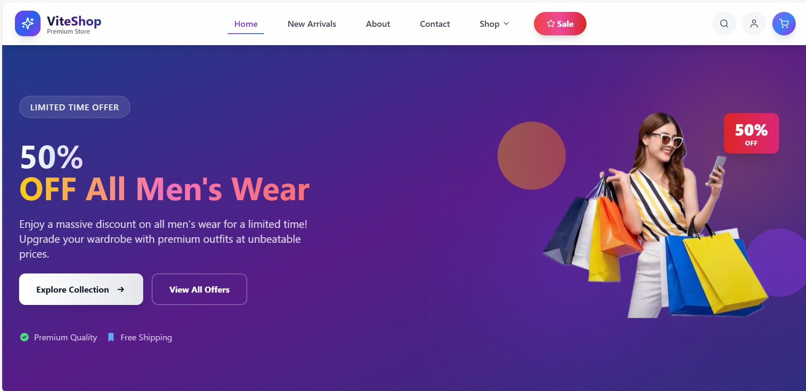

  <!-- Header Banner -->
  

  

    <b>Curiosity & Clean Code • State Engineering Student @ ENSA Tangier</b>
  

  

    
    
    
    
    
  

  

    
    
  

---

## 👨‍💻 About Me

<table>
  <tr>
    <td width="65%" valign="top">
      

        I'm <b>NICHAN SAID</b>, a final-year <b>Computer Engineering student at ENSA Tangier</b> (National School of Applied Sciences), currently seeking an <b>End-of-Studies Internship (PFE)</b> and full-time software engineering roles.
      

      

        I have a strong passion for designing scalable, resilient architectures and crafting sleek user interfaces. With rigorous training in software engineering, system design, and hands-on experience spanning <b>Spring Boot, Angular, React, .NET, Python, and AI/ML pipelines</b>, I transform complex requirements into elegant, high-impact digital products.
      

      <ul>
        <li>🎯 <b>Current Focus:</b> AI-Agent workflows (LangGraph / RAG), Cloud-Native architectures, and microservices.</li>
        <li>🎓 <b>Education:</b> State Engineering Degree in Computer Science @ <b>ENSA Tangier</b> (2024 – 2027) | Preparatory Classes (2022 – 2024).</li>
        <li>⚡ <b>Philosophy:</b> <i>"Curiosity & Clean Code: bridging robust backend with intuitive design through meticulous attention to detail."</i></li>
      </ul>
    </td>
    <td width="35%" align="center" valign="middle">
      
    </td>
  </tr>
</table>

---

## 🚀 Featured Projects

Here is a curated selection of engineering projects featured in my portfolio, spanning **AI systems, Cloud-Native DevOps, Mobile, and Full-Stack Web Applications**:

### 1. 🤖 NextStep — AI-Powered Job Application Lifecycle Platform
> **Code:** `SW.002` | **Type:** Web Application & Multi-Agent AI System  
> **Links:** [GitHub Repository](https://github.com/said101112/NextStep)

NextStep centralizes and automates the candidate recruitment journey: job scraping, semantic offer analysis, auto-tailored CV and email generation, real-time recruiter reply classification, and AI interview prep.

  

- **Frontend:** Angular 19, TypeScript, TailwindCSS, SignalR
- **Backend & Services:** ASP.NET Core, FastAPI, LangGraph (Multi-Agent System), Hangfire
- **Infrastructure & Data:** PostgreSQL, Redis, Keycloak (IAM/OAuth2), Docker Compose
- **Key Highlights:** Autonomous LLM agents for candidate-offer matching, background task orchestration, real-time notifications via SignalR.

---

### 2. 📱 finTruck — Offline-First Personal Finance Tracker
> **Code:** `SW.001` | **Type:** Cross-Platform Mobile Application  
> **Links:** [GitHub Repository](https://github.com/said101112/fintruck)

A privacy-centric, local-first personal finance application that allows users to manage budgets, categorize transactions, and visualize financial growth without external server dependencies.

  

- **Tech Stack:** Flutter, Dart, SQLite, MVC Architecture, `fl_chart`, Local Notifications
- **Key Highlights:** 100% offline data integrity with SQLite, dynamic analytics charts, custom expense categories, light/dark themes, scheduled daily reminders.

---

### 3. 🗺️ Roadmap Builder — Visual Drag-and-Drop Learning Platform + AI Agent (BMO)
> **Code:** `SW.003` | **Type:** Interactive Web Application  
> **Links:** [Live Demo](https://road-map-builder.vercel.app) | [GitHub Repository](https://github.com/said101112/RoadMap-Builder)

A visual canvas that enables users to design, share, and track personalized learning paths and workflows. Supercharged by **BMO**, an embedded AI agent that generates complete structured curriculums from prompt descriptions.

  

- **Tech Stack:** React, React Flow, TypeScript, Node.js, Express.js, PostgreSQL, TypeORM, Docker, Cypress
- **Key Highlights:** Interactive drag-and-drop node graph, AI prompt-to-roadmap synthesis, JSON graph import/export portability (n8n compatible), custom step milestone tracker.

---

### 4. 🎬 Vimo — Cloud-Native Video Streaming Platform & Observability Stack
> **Code:** `SW.007` | **Type:** Cloud-Native Distributed System  
> **Links:** [GitHub Repository](https://github.com/said101112/VIMO)

An enterprise-inspired video streaming engine deployed on a 4-VM architecture orchestrated with Ansible, featuring MinIO S3 chunked storage and end-to-end telemetry.

  

- **Tech Stack:** React (Vite), Node.js, Express.js, MongoDB, MinIO (S3 Object Storage), Nginx
- **DevOps & Observability:** Ansible, Docker & Docker Compose, Prometheus, Grafana, Node Exporter, MongoDB Exporter, Vagrant
- **Key Highlights:** HTTP range chunked media streaming, custom HTML5 media player, full p50/p95/p99 latency dashboards, automated multi-VM provisioning.

---

### 5. 🚦 Traffic Sign Recognition & Localization — Moroccan NARSA Context
> **Code:** `SW.008` | **Type:** Computer Vision & Deep Learning  
> **Client:** ENSA Tangier / NARSA | **Links:** [GitHub Repository](https://github.com/said101112/traffic-sign-recognition)

An end-to-end Computer Vision system engineered for Moroccan road environments, recognizing 43 classes of traffic signs and detecting bounding boxes in real-time.

  

- **Tech Stack:** Python, PyTorch (TrafficSignNet CNN), OpenCV, Flask, Scikit-Learn, CUDA GPU
- **Key Highlights:** **98.80% test accuracy** and **98.28% macro F1** score with custom CNN, hybrid HSV multi-range color filtering + morphological localization, live webcam and image upload inference.

---

### 6. 🏭 Predictive Maintenance BI — Industry 4.0 IoT Decision Platform
> **Code:** `SW.009` | **Type:** Data Engineering & Business Intelligence  
> **Links:** [GitHub Repository](https://github.com/said101112)

A comprehensive data engineering pipeline processing 10,000 IoT sensor records (temperatures, torque, tool wear) to diagnose machine failures and empower proactive industrial decisions.

  

- **Tech Stack:** Power BI, PostgreSQL, Pentaho Data Integration (PDI Spoon), Kimball Star Schema, SQL, IoT Sensor Analytics
- **Key Highlights:** Dimensional Kimball star schema, fault-tolerant asynchronous ETL with synchronization barriers against race conditions, executive Power BI dashboard pinpointing root-cause failure patterns.

---

### 7. 🎓 EVALY — Continuous Soft Skills Evaluation Platform
> **Code:** `SW.004` | **Type:** Web Application & QA Automation  
> **Client:** ENSA Tangier | **Links:** [GitHub Repository](https://github.com/said101112/Evaly)

A multi-actor academic assessment platform facilitating self, peer, and professor evaluations to track behavioral competencies throughout students' academic journey.

  

- **Tech Stack:** Vue.js, Express.js, PostgreSQL, Sequelize, Cypress, Vitest, Docker, k6
- **Key Highlights:** Multi-tier evaluation matrix, automated E2E testing pipelines with Cypress, scalability & stress testing with k6 integrated into CI/CD.

---

### 8. 💬 FlowCom — Real-Time Chat & Collaboration Application
> **Code:** `SW.005` | **Type:** Real-Time Web Application  
> **Links:** [GitHub Repository](https://github.com/said101112/ChatAppMessage)

A WhatsApp-inspired instant communication platform supporting live chat rooms, instant notifications, and user presence tracking.

  

- **Tech Stack:** Angular, Express.js, MongoDB, Socket.io, JWT Authentication
- **Key Highlights:** WebSocket bi-directional event stream, persistent room management, dynamic messaging state, and responsive desktop/mobile layout.

---

### 9. 🛍️ ShopVite — Full-Stack E-Commerce Platform
> **Code:** `SW.006` | **Type:** E-Commerce Web Application  
> **Links:** [GitHub Repository](https://github.com/said101112/Ecommerce2)

A modern e-commerce web application focused on speed, modular state management, and friction-free checkout.

  

- **Tech Stack:** React.js, Tailwind CSS, Express.js, PostgreSQL, RESTful APIs
- **Key Highlights:** Optimized database queries, dynamic filtering and cart persistence, sleek responsive design.

---

## 💼 Work Experience

- 🏢 **FOCUS NEXT COMPUTING** | *Full-Stack Developer Intern* (Casablanca, Morocco — Hybrid)  
  **July 2026 – August 2026**
  - Architected and developed a multi-tenant digital healthcare platform compliant with the **HL7 FHIR R4** standard.
  - Implemented microservices using **Spring Boot**, **React**, **PostgreSQL**, and **Keycloak**.
  - Implemented granular authorization policies (**RBAC / ABAC**) using **Open Policy Agent (OPA)**.

- 🏢 **Smart Automation Tech.** | *Full-Stack Intern* (Tangier, Morocco — Remote)  
  **July 2025 – September 2025**
  - Modernized and refactored a legacy commercial marketplace into a high-performance **Angular** frontend.
  - Automated operational workflows and data pipelines using **n8n**.
  - Built and deployed a **RAG-based AI assistant** for internal knowledge base querying.

---

## 🛠️ Technical Skills

<table align="center" width="100%">
  <tr>
    <td width="20%"><b>Languages</b></td>
    <td>
      
      
      
      
      
      
      
      
    </td>
  </tr>
  <tr>
    <td><b>Frameworks & Libs</b></td>
    <td>
      
      
      
      
      
      
      
      
      
    </td>
  </tr>
  <tr>
    <td><b>Cloud & DevOps</b></td>
    <td>
      
      
      
      
      
      
      
      
      
    </td>
  </tr>
  <tr>
    <td><b>Data & AI</b></td>
    <td>
      
      
      
      
      
      
      
    </td>
  </tr>
  <tr>
    <td><b>Testing & QA</b></td>
    <td>
      
      
      
      
    </td>
  </tr>
</table>

---

## 📜 Certifications

- 🏆 **Agile Project Management** — *Google* (2026)
- 🧠 **Machine Learning Operations (MLOps)** — *DeepLearning.AI* (2026)
- ☕ **Java SE 17 Developer** — *Oracle* (2026)

---

## 📊 GitHub Analytics & Activity

  <table border="0">
    <tr>
      <td>
        
      </td>
      <td>
        
      </td>
    </tr>
  </table>
   
  

---

## 📬 Let's Connect!

I am always interested in discussing new technologies, innovative projects, or internship/job opportunities.

- 📧 **Email:** [saidnichan6@gmail.com](mailto:saidnichan6@gmail.com)
- 💼 **LinkedIn:** [linkedin.com/in/nichan-said-940810313](https://www.linkedin.com/in/nichan-said-940810313/)
- 🌐 **GitHub:** [@said101112](https://github.com/said101112)
- 📄 **Curriculum Vitae:** [Download English CV](./assets/cv/Said_Nichan_CV_EN.pdf) | [Télécharger CV Français](./assets/cv/Said_Nichan_CV_FR.pdf)

  Designed with precision & curiosity • © Nichan Said

